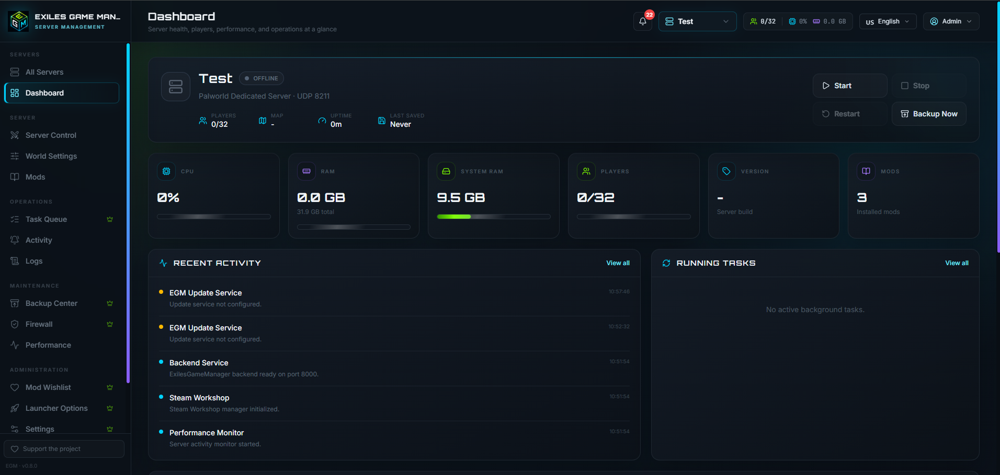
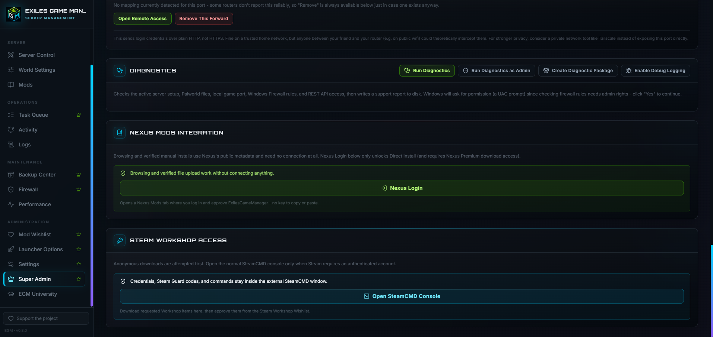

# Exiles Game Manager

Exiles Game Manager (EGM) is a Windows server-management platform with a modern browser-based control panel. The current public beta focuses on Palworld dedicated servers and is designed to expand to Conan Exiles, Rust, ARK and Minecraft in later releases.

> **Beta notice:** This release is intended for community testing. Keep independent backups of important server saves before using management, update or mod-installation features.

## Current beta features

- Multi-instance Palworld server management
- Server start, stop, restart and live status
- World settings and launcher options
- Backup Center and restore workflows
- Windows Firewall management and diagnostics
- Performance monitoring, activity history and task queue
- Steam Workshop browsing, wishlist and installation workflows
- Nexus Mods browsing, wishlist and verified installation workflows
- UE4SS installation from its upstream release source
- Multilingual interface
- Integrated logs and diagnostic export
- GitHub release update notifications

## Screenshots







Additional screenshots are available in the [`images`](images) directory.

## Installation

1. Download `ExilesGameManager-Setup-vX.Y.Z.exe` from GitHub Releases.
2. Run the installer and approve the Windows UAC prompt.
3. Select the installation directory and optional desktop shortcut.
4. Finish setup and launch Exiles Game Manager.
5. Create the first Super Admin account.
6. Import an existing Palworld server or deploy a new instance.

SteamCMD is downloaded from Valve during setup and stored under `%ProgramData%\ExilesGameManager`. The application frontend is served directly by the background backend; no separate frontend process or Node.js installation is required.

## Application data and logs

Program files are installed under the selected installation directory. Runtime data is stored separately under:

```text
%ProgramData%\ExilesGameManager
```

Support logs are available directly in the installation directory under:

```text
Logs\
```

Use the diagnostic export in EGM when reporting a problem.

During uninstall, EGM always removes local login accounts. The uninstaller asks separately whether all remaining runtime data and managed server files should also be deleted. Selecting **No** preserves server data for a later reinstall.

## Automatic updates

EGM checks the configured GitHub Releases channel for newer versions. Super Admins receive an in-panel notification when an update is available. Downloaded Setup packages are verified with their published SHA256 checksum before installation.

## Nexus Mods integration

Public metadata browsing does not require a connected Nexus account. Direct downloads use Nexus Mods authentication and remain subject to Nexus Mods API, SSO, Premium-download and acceptable-use requirements. EGM never asks users to paste a permanent API key into the panel.

## Security

- Passwords are salted and hashed locally.
- Session tokens are held in memory and expire.
- Steam credentials entered in the normal SteamCMD console are not collected by EGM.
- REST API ports should remain private unless explicitly secured for remote access.

Please report security issues privately rather than publishing credentials, tokens, save files or complete logs in a public issue.

## License and attribution

EGM is distributed under the MIT License. The original copyright and license notice are retained.

```text
Copyright (c) 2026 Kvitekvist
Copyright (c) 2026 Whisibear EGM
```

See [`LICENSE`](LICENSE), [`CREDITS.md`](CREDITS.md) and [`THIRD_PARTY_NOTICES.md`](THIRD_PARTY_NOTICES.md).
