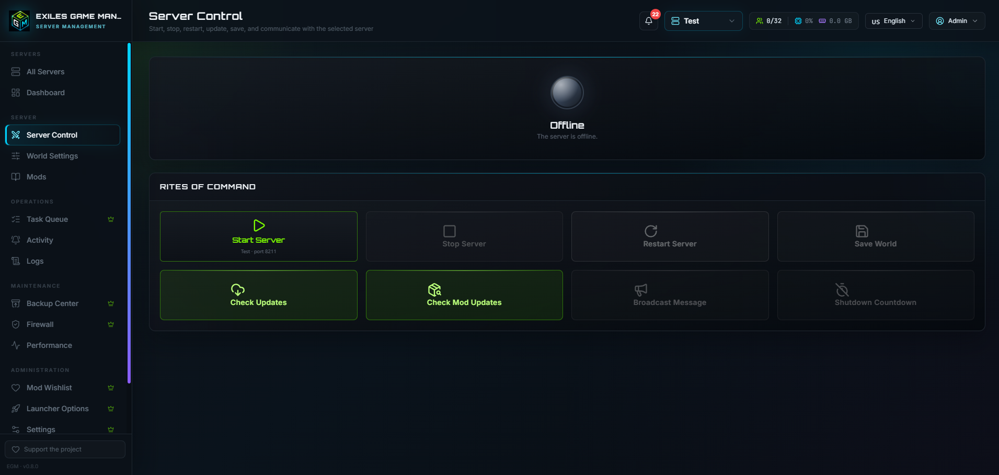
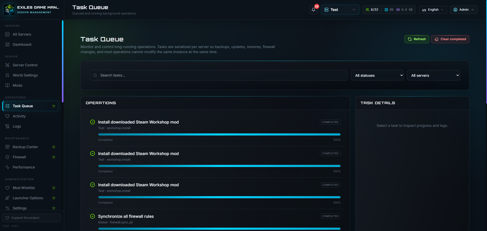
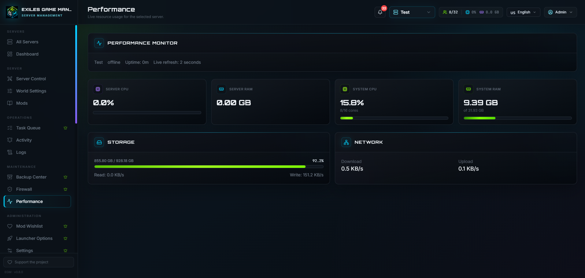
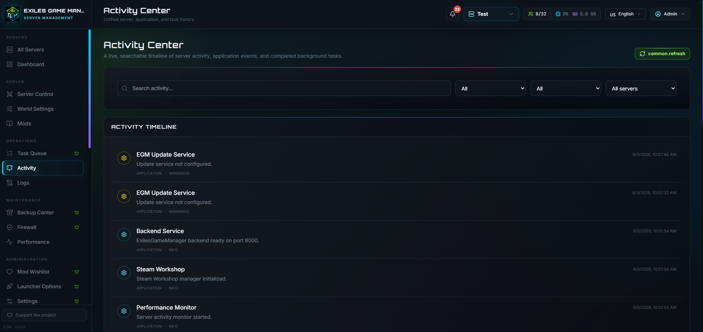
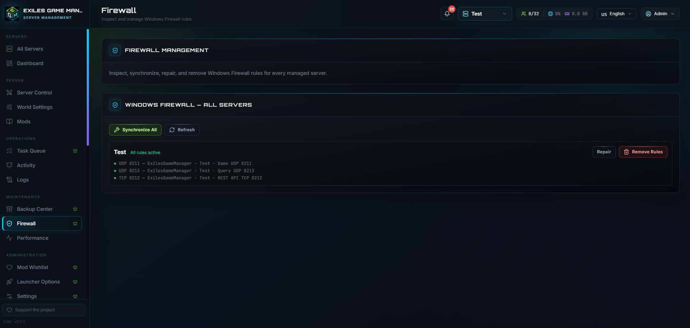
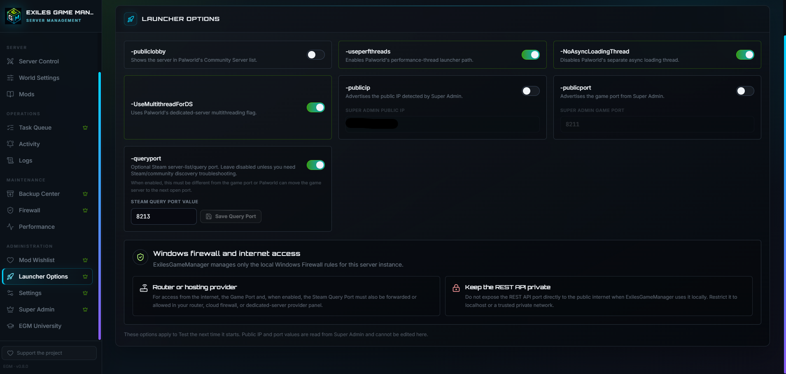
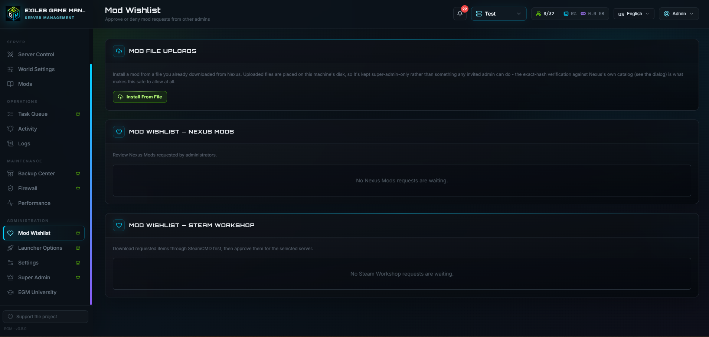
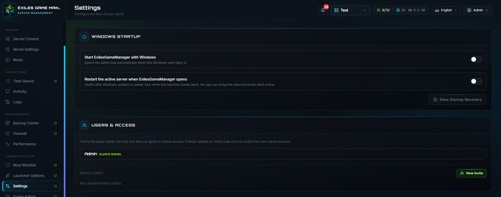
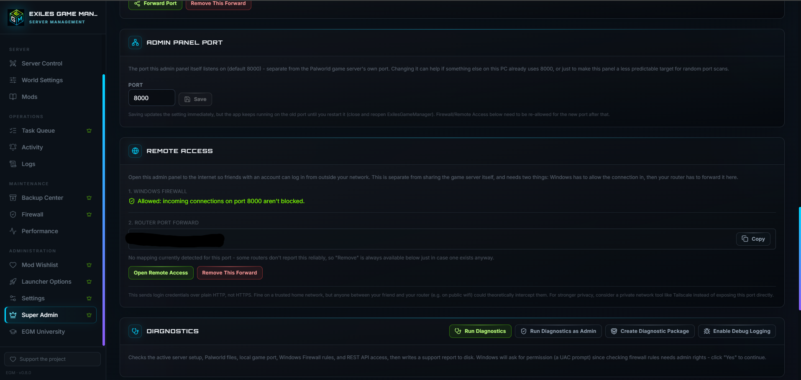

# Exiles Game Manager

Exiles Game Manager (EGM) is a Windows platform for installing, importing and operating dedicated game servers through one modern control panel. The current public beta provides full Palworld workflows and is being prepared for additional games, beginning with Conan Exiles.

> **Beta notice:** Keep independent backups of important saves before using server updates, restore operations or mod installation.

## What EGM helps with

- Importing existing dedicated-server installations
- Deploying and managing multiple server instances
- Starting, stopping and restarting servers
- Editing server and launcher settings
- Creating and restoring scoped backups
- Managing Windows Firewall rules and diagnostics
- Monitoring performance, activity, logs and background tasks
- Browsing and installing Steam Workshop content
- Browsing Nexus Mods metadata and using registered OAuth login for authorized downloads
- Receiving verified application-update notifications from GitHub Releases

## Supported games

| Game | Status |
|---|---|
| Palworld | Public beta |
| Conan Exiles | Planned next integration |
| Additional dedicated servers | Planned through the multi-game module architecture |

## Screenshots

### Dashboard


### Server Control


### Steam Workshop and Nexus Mods


### Task Queue


### Performance Monitor


### Activity Center


### Firewall Management


### Launcher Options


### Mod Wishlist


### Settings


### Super Admin


## Installation

1. Download the current `ExilesGameManager-Setup-vX.Y.Z.exe` from GitHub Releases.
2. Run the installer and approve the Windows UAC prompt.
3. Launch EGM and create the first Super Admin account.
4. Import an existing server or deploy a new supported server instance.

The packaged application serves its own frontend. End users do not need to install Node.js. SteamCMD prerequisites are managed by the installer and EGM workflows.

## Where data is stored

Application binaries are installed under the directory selected in Setup. Per-user application state is stored under:

```text
%LOCALAPPDATA%\ExilesGameManager
├── config
├── cache
├── logs
├── oauth
├── downloads
├── temp
├── backups
└── data
```

Managed dedicated-server installations remain separate under:

```text
%ProgramData%\ExilesGameManager\Servers
```

During uninstall, EGM asks separately whether LocalAppData application data and machine-wide managed server data should be removed. Choosing **No** preserves the selected data for a later reinstall.

## Nexus Mods integration

EGM is registered as a public Nexus Mods application. Login uses OAuth 2.0 Authorization Code flow with PKCE and the local callback:

```text
http://127.0.0.1:8000/api/nexus/oauth/callback
```

Public metadata browsing does not require login. OAuth tokens are encrypted for the current Windows user with Windows DPAPI and are never written to the public source export, logs or diagnostic archives. EGM does not embed a reusable client secret. Direct automatic downloads remain subject to Nexus Mods account permissions, Premium requirements and API policy.

## Security and privacy

- Local EGM passwords are salted and hashed.
- Nexus OAuth tokens are stored encrypted under the current Windows user profile.
- Secrets and runtime data are excluded from the public GitHub source export.
- Steam credentials entered in the SteamCMD console are not stored by EGM.
- Administrative API ports should remain private unless protected by an appropriate network-security design.

Report security issues privately and never attach credentials, OAuth tokens, saves or complete private logs to a public issue.

## Development and support

- Build instructions: [`BUILDING.md`](BUILDING.md)
- Getting started: [`GETTING_STARTED.md`](GETTING_STARTED.md)
- Public changes: [`CHANGELOG.md`](CHANGELOG.md)
- Security policy: [`SECURITY.md`](SECURITY.md)
- Windows Defender and SmartScreen notice: [`WINDOWS_SECURITY_NOTICE.md`](WINDOWS_SECURITY_NOTICE.md)
- Issue tracker: use the repository issue templates

## Privacy and terms

EGM is self-hosted and does not use a Whisibear-operated telemetry, analytics or account server. Application data remains on the host machine unless the operator explicitly uses a third-party feature or voluntarily shares a diagnostic package. External connections for GitHub updates, Nexus Mods, Steam/SteamCMD and optional public-IP lookup are documented in [TERMS_OF_SERVICE.md](TERMS_OF_SERVICE.md).

The terms document also explains local accounts, the functional session cookie, browser local/session storage, caches, OAuth token storage, diagnostics, deletion and host-operator responsibilities.

Windows executable reputation, SmartScreen, antivirus detections, checksum verification and false-positive reporting are documented in [`WINDOWS_SECURITY_NOTICE.md`](WINDOWS_SECURITY_NOTICE.md).

## License and attribution

EGM is distributed under the MIT License. The current project is maintained by Whisibear while the original MIT attribution is preserved. See [`LICENSE`](LICENSE), [`COPYRIGHT_AND_ATTRIBUTION.md`](COPYRIGHT_AND_ATTRIBUTION.md), [`CREDITS.md`](CREDITS.md) and [`THIRD_PARTY_NOTICES.md`](THIRD_PARTY_NOTICES.md).
